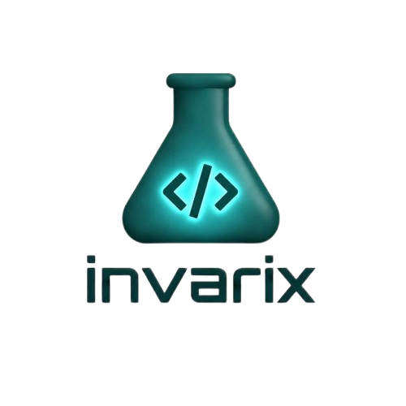
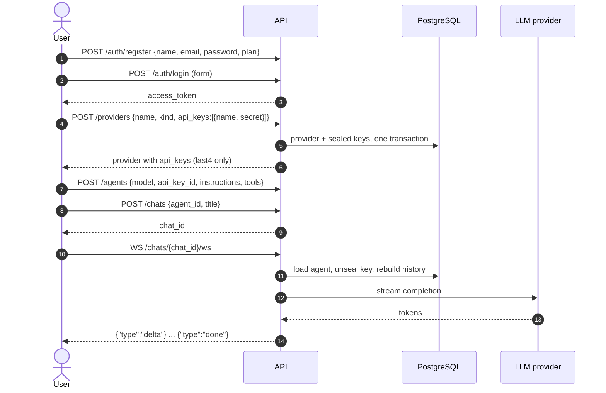
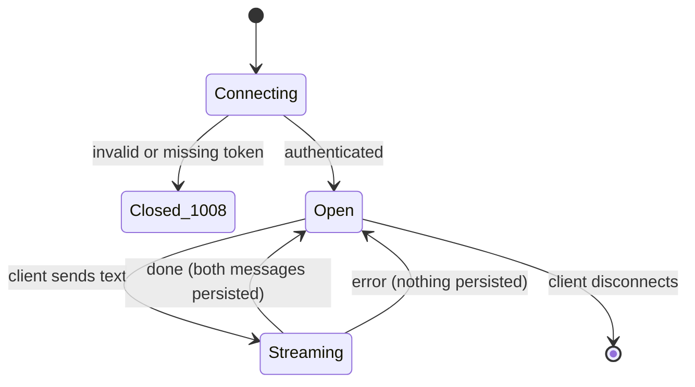
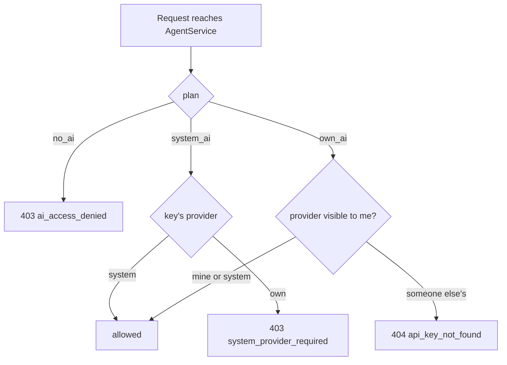
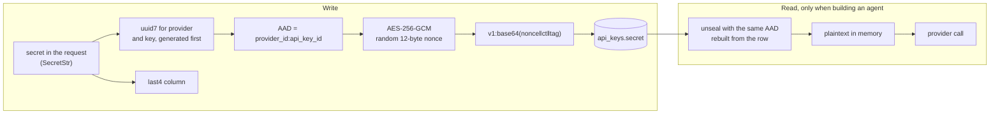
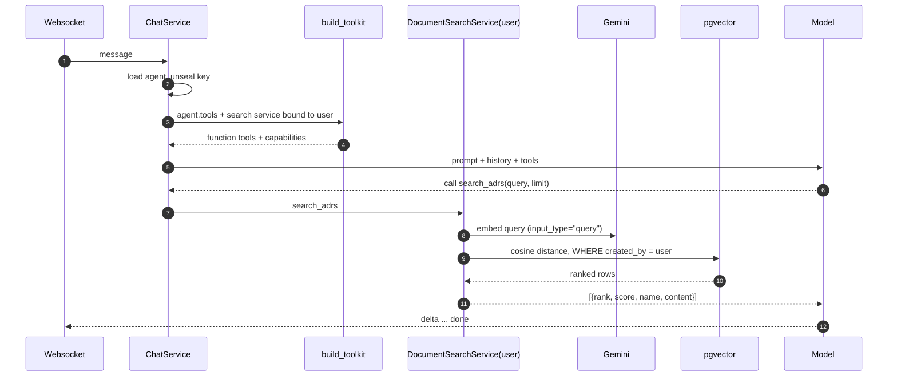
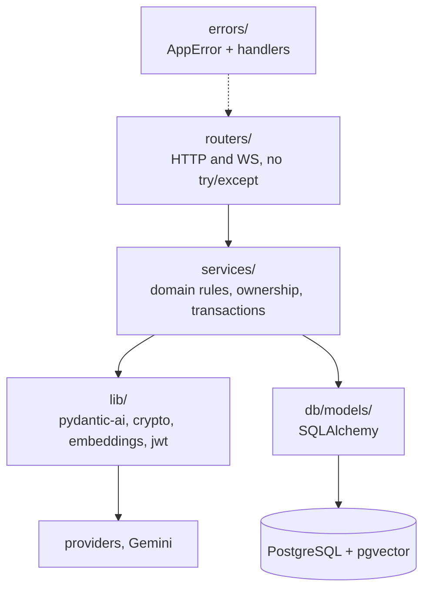

<div align="center">
  
  <h1>Invarix RAG</h1>
  <p><strong>Multi-tenant agent platform where every user brings their own model, their own key, and their own documents.</strong></p>
</div>

---

A FastAPI service where a user registers an LLM provider, stores the API key encrypted, configures an agent with tools, and talks to it over a websocket. Agents answer from that user's own ADRs and stories, retrieved by semantic similarity — never from anyone else's.

- **Bring your own key.** Provider credentials are encrypted at rest with AES-256-GCM, bound to the row they live in.
- **Agents are data, not code.** Model, instructions and tool list are rows; no deploy to add an agent.
- **Tools carry user context.** A tool is built per chat around the requesting user, so scoping is not something a query has to remember.
- **Streaming chat.** Websocket with delta / done / error events, history rebuilt from the database on every connect.

## Stack

| | |
|---|---|
| API | FastAPI, Python 3.14, `uv` |
| Agents | pydantic-ai 2.35 |
| Database | PostgreSQL 18 + pgvector |
| Embeddings | Gemini `gemini-embedding-001`, 1536 dimensions |
| Auth | JWT HS256, argon2 password hashing |
| Crypto | AES-256-GCM via `cryptography` |
| Observability | Logfire |

## Getting started

Requirements: [`uv`](https://docs.astral.sh/uv/), [`just`](https://github.com/casey/just), Docker.

```bash
git clone <repo> && cd rag-poc
uv sync

cp .env.example .env
just encryption-key          # paste the output into ENCRYPTION_KEYS
# fill POSTGRES_*, JWT_SECRET and GEMINI_API_KEY too

just up                      # postgres + pgweb
just migration-up            # apply migrations
just dev                     # http://localhost:8000/docs
```

Optional, and the fastest way to see it working:

```bash
just seed                    # dev@invarix.local / senha12345, with documents, provider, agent and chat
```

### Environment

| Variable | Required | Notes |
|---|---|---|
| `POSTGRES_*` | yes | host, port, database, user, password |
| `JWT_SECRET` | yes | signs access tokens |
| `ENCRYPTION_KEYS` | to store API keys | versioned list, `v1:<base64 32 bytes>`; see [Key rotation](#key-rotation) |
| `GEMINI_API_KEY` | to embed documents | document and query embeddings |
| `LOGFIRE_TOKEN` | no | traces are local-only without it |
| `JWT_EXPIRE_MINUTES` | no | defaults to 1440 |

## First agent, end to end

Five calls from nothing to a conversation. Everything after step 2 carries `Authorization: Bearer <token>`.



### 1. Register and log in

```http
POST /auth/register
{"name": "Ada", "email": "ada@example.com", "password": "senha12345", "plan": "own_ai"}

POST /auth/login          (application/x-www-form-urlencoded)
username=ada@example.com&password=senha12345
→ {"access_token": "eyJ...", "token_type": "bearer"}
```

### 2. Provider with its keys

Keys are part of configuring a provider, so they go in the same payload and the same transaction.

```http
POST /providers
{
  "name": "OpenRouter",
  "kind": "openrouter",
  "api_keys": [{"name": "prod", "secret": "sk-or-v1-..."}]
}
```

The response carries the key back as `{"id", "provider_id", "name", "last4", "created_at", "updated_at"}`. **The secret is never returned by any endpoint** — it leaves the database only to be handed to the provider.

> **`base_url` decides how the model is built, not `kind`.** Leave `base_url` empty and prefix the agent's model (`openrouter:deepseek/deepseek-v4-pro-0813`) to get the provider's native class, with its native features. Set `base_url` and the model is built as a generic OpenAI-compatible endpoint, which silently costs you things like native web search. See [Points of attention](#points-of-attention).

### 3. Agent

```http
POST /agents
{
  "name": "Architect",
  "model": "openrouter:deepseek/deepseek-v4-pro-0813",
  "api_key_id": "<from step 2>",
  "instructions": "Search the ADRs before answering about architecture, and cite which one you used.",
  "tools": ["search_adrs", "search_stories", "web_search"]
}
```

### 4. Chat, then the websocket

```http
POST /chats  {"agent_id": "...", "title": "Architecture review"}
```

## Websocket

FastAPI does not publish websockets in OpenAPI, so `/docs` does not show this one. It is the only websocket in the service.

```
WS /chats/{chat_id}/ws
```

**Authentication**, either way:

| Transport | How |
|---|---|
| Header | `Authorization: Bearer <jwt>` |
| Query param | `?token=<jwt>` |

The query parameter exists because the browser `WebSocket` API cannot send headers. Prefer the header anywhere else — a token in the URL ends up in access logs.

Authentication happens **before** the handshake completes. A bad or missing token closes the connection with code `1008` and the error code as the close reason (`invalid_token`, `user_not_found`) — no error event, because there is no connection yet.

**Sending:** plain text, one message per turn. Not JSON.

**Receiving:** one JSON object per event.

```json
{"type": "delta", "text": "partial "}
{"type": "done",  "message_id": "01a0..."}
{"type": "error", "code": "chat_response_failed", "message": "Falha ao gerar resposta"}
```

An `error` event **keeps the connection open** — send another message and it works. Errors reaching this event include `chat_not_found` (the chat is not yours), `ai_access_denied` (plan without AI), `secret_decryption_failed` and `chat_response_failed` (the provider failed).



## Plans

The plan is a property of the user and gates two things: whether they can use AI at all, and whose credentials they may spend.

| Plan | Own providers | Which keys | Agents and chat |
|---|---|---|---|
| `no_ai` | no | none | blocked (`ai_access_denied`) |
| `system_ai` | no (`own_provider_not_allowed`) | system providers only (`system_provider_required`) | yes |
| `own_ai` | yes | own and system | yes |

A **system** provider or agent is one with `owner_id IS NULL`. Everyone sees them, nobody can edit them (`system_resource_read_only`), and one `or_` covers "mine plus the system's" — there is no mirror table to keep in sync.



Note that enforcement is at **use** time, in `AgentService.resolve_usable_key`, not only at creation. A user downgraded from `own_ai` keeps their providers but can no longer spend them.

## How API keys are stored

The threat this addresses is a leaked database: a dump, a replica, a stolen backup. It does not protect against a compromised host, which holds the encryption key.



Three properties worth stating explicitly:

**The AAD binds the ciphertext to its row.** Additional Authenticated Data is authenticated but not encrypted, and it is *not stored in the blob* — it is rebuilt from where the row lives. A valid blob moved to another `api_key_id`, or to a provider owned by someone else, fails authentication instead of decrypting. This closes ciphertext relocation: SQL injection with write access, a backup restored onto the wrong row, a future "duplicate provider" feature.

**The IDs are generated before sealing.** `uuid7()` is created in the service rather than left to the database default, so the AAD is complete on the first insert with no second round trip.

**The plaintext has exactly one exit.** `ChatService` unseals when building the agent. No response schema carries the secret, and `ApiKeyResponse` exposes `last4` as a real column, because `secret[-4:]` over ciphertext is meaningless.

### Key rotation

`ENCRYPTION_KEYS` is a comma-separated versioned list. The **first** key seals; **all** of them open. The `v1:` prefix in each blob selects which one.

```
ENCRYPTION_KEYS=v2:<new base64>,v1:<old base64>
```

New writes go out as `v2`, old `v1` blobs keep opening. Two caveats: rows are only re-encrypted when rewritten, so retiring `v1` needs a pass over the table first; and the keyring is cached, so a rotation needs a restart.

> Losing `ENCRYPTION_KEYS` with no backup means losing every stored API key. There is no recovery — users re-enter them.

## Agents and tools

An agent row carries everything needed to build it: `model`, `instructions`, `api_key_id` and `tools`. Nothing is compiled in.

| Tool | What it does |
|---|---|
| `search_adrs` | Semantic search over **the requesting user's** ADRs, ranked, up to 20 |
| `search_stories` | Same, over stories |
| `web_search` | The provider's native web search (pydantic-ai capability, not a function tool) |

Unknown names are rejected twice: by the schema (422, listing the valid values) and again in `AgentService`, for callers that do not come through HTTP.

### Tools with user context

The scoping is structural. `build_toolkit` closes over a `DocumentSearchService` that was already constructed with the requesting user, so there is no code path where a tool query forgets the filter — the tool function has no way to name another user.



Two details that matter for retrieval quality:

**Queries and documents are embedded differently.** Gemini's retrieval embeddings are asymmetric: documents are indexed with `input_type="document"` and questions are embedded with `input_type="query"`. Using one type for both measurably degrades ranking.

**The ceiling is enforced twice.** `limit` is `Annotated[int, Field(ge=1, le=20)]` in the tool schema, so the model is told the maximum, and `min(limit, MAX_RESULTS)` in the service, so an internal caller cannot exceed it either.

Results come back ranked, with `score = 1 - cosine_distance`:

```json
[{"rank": 1, "score": 0.7501, "id": "...", "name": "ADR-009 Lot tracking", "content": "..."}]
```

## Document scoping

ADRs and stories belong to whoever created them, enforced in `DocumentService` for every operation. Reading or deleting someone else's document answers **404, not 403**, so existence does not leak.

## Architecture



Routes carry no `try/except`: services raise `AppError` subclasses and a FastAPI exception handler turns them into `{"code", "message"}`. The websocket dependency translates the same errors into a `WebSocketException`, and the chat loop into an `error` event.

## Points of attention

This is a proof of concept. These are known and deliberate, listed so nobody has to discover them.

**`plan` is accepted in the register payload.** Anyone can register as `own_ai`. It is self-service privilege escalation, kept on purpose to make the POC testable without hand-written SQL. It must not ship.

**`PATCH` cannot clear a nullable field.** Services test `if value is not None`, so an explicit `null` is indistinguishable from an absent field. Affects `providers.base_url` and `agents.instructions`; clearing them requires a direct database update today.

**`kind` is a label, `base_url` is the router.** Any provider with `base_url` set is built as a generic OpenAI-compatible model, losing the provider's native class — which is how you get `WebSearchTool is not supported with OpenAIChatModel`. Making `kind` select the model class is the fix.

**Embeddings have no foreign key.** `source_id` points at two tables depending on `source_type`, so a cascade that deletes documents (deleting a user, for one) leaves embedding rows behind, vectors included. `DocumentService.delete` handles it; nothing else does.

**The encryption key sits next to the database credentials.** Everything under [How API keys are stored](#how-api-keys-are-stored) protects a leaked database, not a compromised host. Moving the key out of the host — and out of wherever the database backup lands — is the cheapest real improvement.

**There is no audit trail of key usage.** Nobody can answer "who used this customer's key, and when". Unlike the others, this data cannot be reconstructed later: it has to be recorded from the first day it matters.

**No rate limiting or quota per key.** A compromised key can be burned quickly, and the bill lands on the customer.

**Small models are unreliable with tools.** A 4B model will often ignore a tool, or call it with malformed arguments. Not a bug in the service, but it looks like one while testing.

## Development

```bash
just                    # list every recipe
just dev                # reload server
just seed               # demo user with documents, provider, agent and chat
just up / down / logs   # containers
just migration-auto "message"    # autogenerate from model diff
just migration-up / migration-down / migration-current
just encryption-key     # new v1:<base64> key
```

Migrations are Alembic in async mode. `uv run alembic check` verifies the models match the schema.
